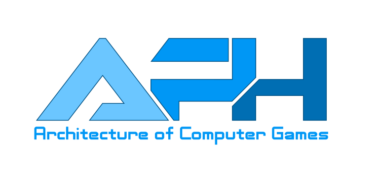

    

## Architecture of Computer Games

- 🎓 3rd year already
- 📦 New slides
- 🎮 New examples
- 🔥 Live deployment

## Main focus of this subject

- methodologies from the viewpoint of game development
- component architecture and ECS pattern
- game mechanics
- dynamics and physics
- game AI, pathfinding
- scripting languages
- multiplayer

Development takes place in **PixiJS rendering library** in TypeScript

Lecturer's e-mail: [vesecky.adam@gmail.com](mailto:vesecky.adam@gmail.com) or [svecadam@fit.cvut.cz](mailto:svecadam@fit.cvut.cz)

Changelog is available [here](./CHANGELOG.md)

## What you may need to know

- everything is located inside this repository, **🙌including slides🙌** , no external sources, no moodle
- tutorial explaining how to make this project work can be found [here](./docs/environment.md)
- requirements to finish this course can be found [here](./docs/requirements.md)
- assessment of semestral works and exams will be located on [grades.fit.cvut.cz](https://grades.fit.cvut.cz/)

## Materials

Upon every commit, gitlab will synchronize the content with a live environment in [AWS S3 Bucket](http://dodoworks.s3-website.eu-central-1.amazonaws.com/)

All slides were made by a modified version of [RevealJS](https://github.com/hakimel/reveal.js/). Its source code was rewritten into TypeScript and it's part of this repository as it may be constantly modified during the course.

Keyboard shortcuts for the slides:

| Key | Action | 
| ------ | ------ | 
| N, SPACE | Next slide | 
| P | Previous slide |
| ← , H | Navigate left |
| → , L | Navigate right |
| ↑ , K | Navigate up |
| ↓ , J | Navigate down |
| Home , ⌘/CTRL ← | First slide |
| End , ⌘/CTRL → | Last slide |
| F | Fullscreen |
| ESC, O | Slide overview |
| CTRL + Shift + F | Search |

### Browser support

- RevealJS used as a presentation framework supports all browsers since 2012 (Chrome 24+, Firefox 4+, IE10+, Edge, Safari, Opera)
- custom styles were tested against Chrome 77 and Firefox 69 (Windows, Linux and Android platforms)
- if you bump into anything that appears wrongly aligned, or worse, broken, feel free to send an e-mail to the lecturer

### PDF Export

- yes, it is supported 🙌
- you should use `Google Chrome` since it has got a built-in PDF export and the slides were optimized for it
- go to the dashboard (`index.html`) and click on `PRINT` label in the cell of particular presentation
  - alternatively, navigate to a presentation you want to export either on your localhost or live environment and put `?print-pdf` as a query string (e.g. `localhost:1234/lecture00.html?print-pdf`)
- in this mode, you will see all slides aligned vertically, stripped out of all visual effects and glowing backgrounds
- press right mouse button, select `print`
- select `Save as PDF` as the Destination, don't forget to check `Background graphics`
- wait for the preview to be generated and click on `Save`

- if you want to change the style of the slides (fonts, colors), more information can be found [here](./docs/environment.md)

## Lectures

Will be added on the day the particular lecture takes place

| Week | Date | Topic | Link |
| ------ | ------ | ------ | ------ |
| 1 | 24.9. | Introduction to the world of games | [Link 1](http://dodoworks.s3-website.eu-central-1.amazonaws.com/lecture00.html) [Link 2](http://dodoworks.s3-website.eu-central-1.amazonaws.com/lecture01.html)  |
| 2 | 1.10. | Architecture of game engines |  [Link](http://dodoworks.s3-website.eu-central-1.amazonaws.com/lecture02.html) |
| 3 | 8.10. | Component architecture I |  [Link](http://dodoworks.s3-website.eu-central-1.amazonaws.com/lecture03.html) |
| 4 | 15.10. | Component architecture II | [Link](http://dodoworks.s3-website.eu-central-1.amazonaws.com/lecture04.html) |
| 5 | 22.10. | Game programming patterns | [Link](http://dodoworks.s3-website.eu-central-1.amazonaws.com/lecture05.html) |
| 6 | 29.10. | Math and dynamics | [Link](http://dodoworks.s3-website.eu-central-1.amazonaws.com/lecture06.html) |
| 7 | 5.11. | Physics | [Link](http://dodoworks.s3-website.eu-central-1.amazonaws.com/lecture07.html) |
| **8** | **12.11.** | **Graphics** | [Link](http://dodoworks.s3-website.eu-central-1.amazonaws.com/lecture08.html) |
| 9 | 19.11. | Game AI | |
| 10 | 26.11. | Scripting languages | |
| 11 | 3.12. | **DAY OFF** | |
| 12 | 10.12. | Multiplayer | |
| 13 | 17.12. | Indie Game Development | |

## Labs

| Week | Date | Topic | Link |
| ------ | ------ | ------ | ------ |
| 1O | 24.9. | Introduction to the environment | [Link](http://dodoworks.s3-website.eu-central-1.amazonaws.com/lab01.html) |
| 2E | 1.10. | Introduction to the environment | [Link](http://dodoworks.s3-website.eu-central-1.amazonaws.com/lab01.html) |
| 3O | 8.10. | PixiJS basics | [Link](http://dodoworks.s3-website.eu-central-1.amazonaws.com/lab02.html) |
| 4E | 15.10. | PixiJS basics |  [Link](http://dodoworks.s3-website.eu-central-1.amazonaws.com/lab02.html) |
| 5O | 22.10. | Component architecture  |  [Link](http://dodoworks.s3-website.eu-central-1.amazonaws.com/lab03.html) |
| 6E | 29.10. | Component architecture | [Link](http://dodoworks.s3-website.eu-central-1.amazonaws.com/lab03.html) |
| 7O | 5.11. | Animation, physics  | [Link](http://dodoworks.s3-website.eu-central-1.amazonaws.com/lab04.html) |
| **8E** | **12.11.** | **Animation, physics** | [Link](http://dodoworks.s3-website.eu-central-1.amazonaws.com/lab04.html) |
| 9O | 19.11. | Game AI | |
| 10E | 26.11. | Game AI | |
| 11O | 3.12. | **DAY OFF**  | |
| 12E | 10.12. | Multiplayer | |
| 13O | 17.12. | Multiplayer | |

## Old materials

[Materials from 1st year (OBSOLETE)](https://www.dropbox.com/s/89su9beu24a0m1r/FIT_APH_2017.zip?dl=0)

[Materials from 2nd year](https://www.dropbox.com/s/pin6nvqp714hh7x/FIT_APH.zip?dl=0)

