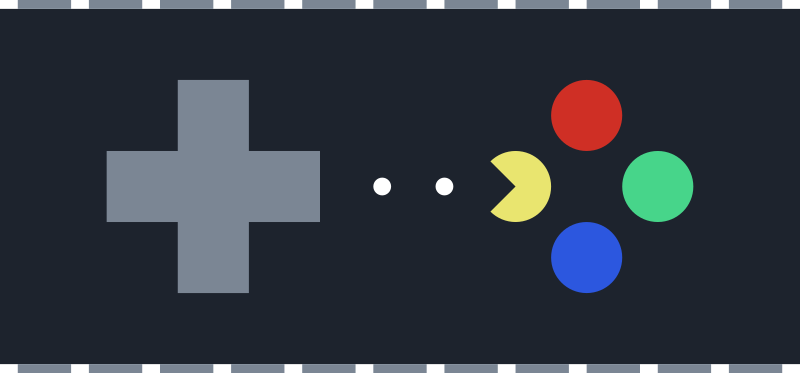

# Architecture of Computer Games

    

- 🎓 4th year already
- 📦 New slides
- 🎮 New examples
- 🎨 New design
- 🔥 &nbsp;New dashboard 

## About this repo
- everything is located inside this repository - slides, examples and dashboard. No other external sources!
- **everything gets automagically deployed to [aph.dodo.me](https://aph.dodo.me)** - there you will find everything you need
- **all tutorials and docs** can be found in markdown files in `wiki/docs`, but it's much better to check them out deployed [here](https://aph.dodo.me/docs/seminars)

## How to build this project
- clone it
- install [nodeJS](https://nodejs.org/en/download/), LTS version if possible 
- execute `npm install`
- if you want to build the examples, run `npm run dev-examples` and navigate to `localhost:1234/index.html`
- if you want to build the slides, run `npm run dev-slides` and navigate to `localhost:1234/index.html`
- if you want to build the wiki:
  - go to wiki folder
  - execute `npm install`
  - execute `npm start` and navigate to `localhost:3000`
- if you want to build everything
  - execute `npm run deploy-all` from the root folder. Everything gets bundled into `build_wiki` 

Changelog is available [here](./CHANGELOG.md)

## Old materials

[Materials from 1st year (PDF)](https://www.dropbox.com/s/89su9beu24a0m1r/FIT_APH_2017.zip?dl=0)
[Materials from 2nd year (PDF)](https://www.dropbox.com/s/pin6nvqp714hh7x/FIT_APH.zip?dl=0)
[Materials from 3rd year (S3 bucket)](dodoworks.s3-website.eu-central-1.amazonaws.com/)