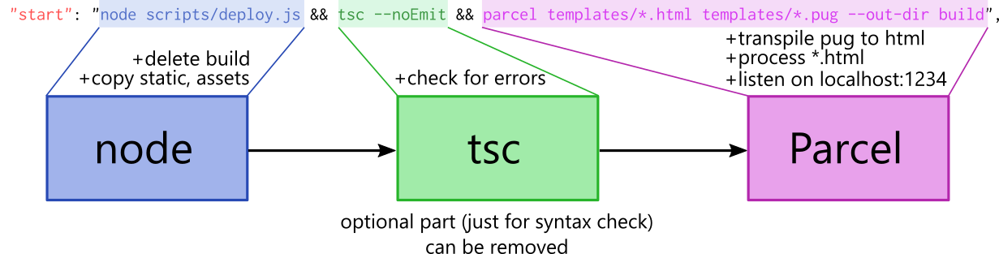

# MI-APH Environment

## Project structure

```
project
│
└───assets                  // PixiJS assets (images, sounds,...)
│   
└───build                   // output folder
│
└───docs                    // documentation
│
└───libs                    // 3rd party libraries that are not in node_modules
│   │   pixi-sound          // sound support for PixiJS lib
│   │   revealjs            // RevealJS presentation library rewritten into TS
│
└───mobile                  // cordova project for android deployment
│
└───scripts                 // nodeJS pre-build scripts
│
└───src                     // source files
│   │   labs                // examples relevant to particular labs
│   │   lectures            // source code for lectures
│
└───static                  // static HTML files (CSS, fonts, images)
│   │   intro               // intro animation spritesheet
│   │   revealjs            // revealjs static resources
│   │   slides              // slides styles, fonts and images
│
└───templates               // HTML and PUG templates, processed by ParcelJS
│   │   partial             // partial PUG views (only for slides and the dashboard)
│    
│   CHANGELOG.md             // changelog
│   package.json             // npm scripts and dependencies
│   README.md                // README file
│   tsconfig.json            // typescript config (only for pre-build)
│   tslint.json              // typescript linter for static checking
```

## Basic setup

- install [Node Package Manager](https://www.npmjs.com/)
  - for Unix: `sudo apt install npm`
- go to the root directory of this project
- install all dependencies: `npm install`
- run the dev-server: `npm start`
- go to `localhost:1234/index.html` - you should see the dashboard
- go to `localhost:1234/intro.html` - you should see the intro animation of this subject
- if you are using **Visual Studio Code**, don't forget to install `Debugger for Chrome`
- go to `localhost:1234/lab01_sprite.html` - you should see a rotating sprite. Try out your debugger by setting a breakpoint in `src/labs/lab01_sprite.ts`
- try to change a few lines of code and save your changes. `ParcelBundler` should re-compile and reset the page
- go to `localhost:1234/lab01.html` to access the slides for the first lab

## Watch mode
- `ParcelBundler` will recompile everything as soon as you change something in your code
- **you have to re-execute** `npm start` if you add a new asset (sound, image, html, css,...)

## Troubleshooting
- if `ParcelBundler` wrote some error in the console after you had saved your changes, just press `ctrl+s` again. If it doesn't help, just press `ctr+c`, terminate it and re-run `npm start`
- if you change any of your static files, especially images, you may need to re-run `npm start` since `ParcelBundler` will start throwing some errors while in the watch mode
- if you can't build your project because of weird `TypeScript` errors that don't come from your own code, just go into `package.json` and remove `&& tsc --noEmit` from all scripts - it's a pre-compile step that only checks out the syntax

## Libraries

- [**PixiJS**](https://www.pixijs.com/) - HTML5 creation engine
- [**ParcelBundler**](https://github.com/parcel-bundler/parcel) - fast web application bundler
- [**RevealJS**](https://revealjs.com/) - library used for presentation slides. It was slightly modified and rewritten into TypeScript. The source codes are part of this repository located in `libs/revealjs`
- [**Cordova**](https://cordova.apache.org/) - platform for mobile development

## NPM Scripts
- `npm start` - builds all source files and starts a dev-server. By default it listens on `localhost:1234`
  - important note: since `ParcelBundler` doesn't take care of TypeScript type errors, the actual `tsc` compiler is executed beforehand just to check the code. You can remove this part from the npm script command in `package.json` file, if you like
- `npm run clean` - removes the cache and all built files
- `npm run deploy` - builds all source files and minifies them
- `npm run lint` - executes tslint for static analysis of the source code
- `npm run clean_materials` - removes all materials from the project and keeps only raw pixiJS skeleton

## Building pipeline

<p align="center">
    
</p>

- it's a bit tricky to comprehend how this project is built
- at the end of the day, everything goes into `build` folder
- all views are located in `template/*.html` and `template/*.pug` (only slides and the dashboard)
- `ParcelBundler` goes over each `*.html` and `*.pug` file inside the `templates` directory, compiles all linked files (SCSS, TypeScript, JavaScript,...) and puts them into `build` folder
- this is however done only for static files. If you, for instance, load a script or an asset dynamically, `ParcelBundler` will not detect it. That's why those two folders, `assets` and `static`, are copied to the `build` folder explicitly (`npm script` executes `scripts/deploy.js` script that takes care of it)
- therefore it is important to know whether you are linking a static file or a dynamic one. For instance, if you are linking a css inside your html file that is inside the `static` directory, you will link it this way: `../static/myStyle.css` and `ParcelBundler` will change the path to something like `myStyle.d6r54a65.css` and place the style to the same folder. However, if you want to load this style dynamically, it would be linked via `./static/myStyle.css`.
- in other words, if you are linking something that will be processed by `ParcelBundler`, think of it as if you were inside `templates` folder. If you are linking something dynamically (anything from within a script), think of it as if you were inside `build` folder and the `static` and `assets` folders was copied into it
- luckily, if you only work with PixiJS and TypeScript, using a simple HTML template, you will link everything dynamically

## Create a custom project

- just create a new HTML file in the `templates` folder and link your TypeScript files using `<script>` tags. Look at `lab01_sprite.html` example.
- `ParcelBundler` will compile the TypeScript files into JavaScript and put everything into `build` folder
- after you run `npm start`, your page will be accessible from `localhost:1234/<your-file>.html`
- **place all your source code into the `~/src` folder**

## Cordova

- if you want, you can wrap your source code into a mobile application
- if you don't, you can ignore the `mobile` folder completely
- this repository contains metadata for android platform only
- at first, build your project by executing `npm run deploy` from the root folder
- go to the mobile folder and execute script  `npm run android`. It will copy all files from the build folder into `mobile/www` folder of the cordova application
- edit  `www/index.html` file to point to your html file
- **be advised that you need to load all dynamic resources in this format: `./assets/myRes.png`, having a dot at the beginning, not `/assets/myRes.png`**

## Deployment

- with every commit, this project is published to an [AWS S3 bucket](http://dodoworks.s3-website.eu-central-1.amazonaws.com/)

## Custom styles

- if you want to change the style of the slides, feel free to do so by editing particular Sass files, located in `static/slides/css`
-  `colors.scss` - all colors used in the slides
-  `dashboard.scss` - styles for dashboard page
-  `fonts.scss` - all fonts used in the slides
-  `intro.scss` - styles for intro page
-  `lab01.scss, lab02.scss,....` - styles for particular labs
-  `lecture00.scss, lecture01.scss,....` - styles for particular lectures
-  `slides.scss` - styles for common slides (logos, signature,...)
-  `theme.scss` - **main theme** for the slides